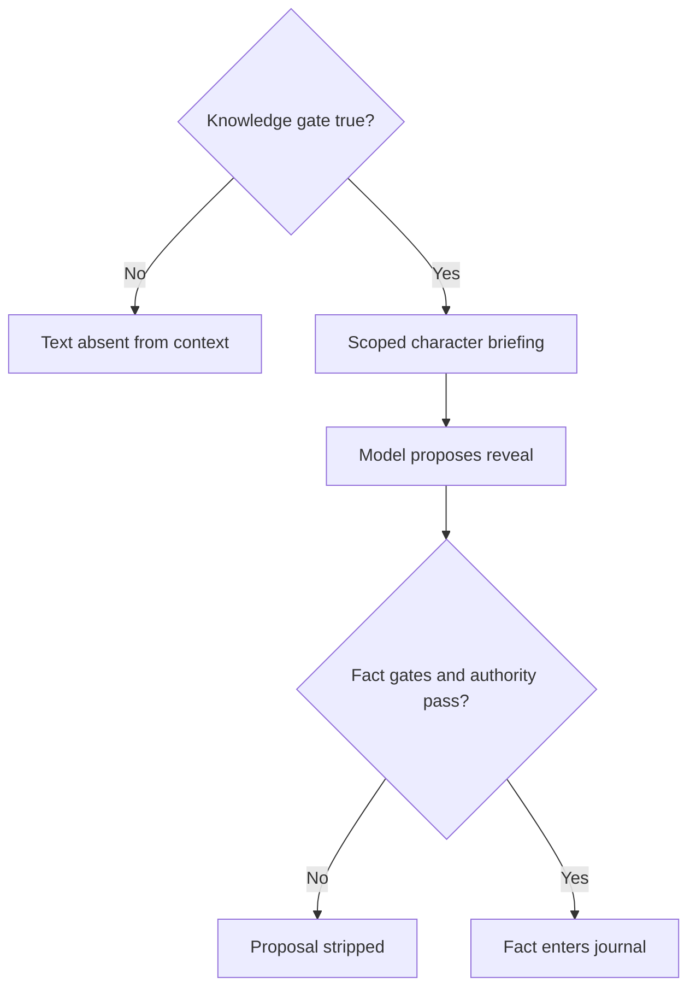

# Mental model

DARPS divides responsibility deliberately:

| Owner | Responsible for |
|---|---|
| Host game | Location, presence, inventory, quests, progress flags, save slots |
| Pack | Authored world, characters, knowledge, facts, conditions, prose guidance |
| DARPS engine | Context isolation, validation, narrative state, deltas |
| LLM | Classification and narration proposals |

## Facts, knowledge, and canon

- A **fact** is a gated piece of truth the player can learn. Its authored
  `journal_text` becomes the journal entry.
- **Knowledge** is information supplied to a particular character's prompt.
  It may authorize that character to reveal a fact.
- **Shared knowledge** belongs to the entity it describes and reaches relevant
  characters whose knowledge scopes permit it.
- **Canon** records concrete improvised or host-established details that are
  not part of the authored fact web.

## Tracks and persona

Character **tracks** answer “how does this character currently feel toward the
player?” Each character has its own values and performs them through prose.

**Persona** answers “how consistently is the player inhabiting the authored
role?” Values are session-wide, queryable by the host, and never enter response
prompts.

## Structural secrecy

Secrets are protected by absence, not merely instruction. A false `when` gate
means the knowledge text never enters the prompt. Even knowledge present in a
prompt cannot become a journal fact unless the engine authorizes the reveal.

