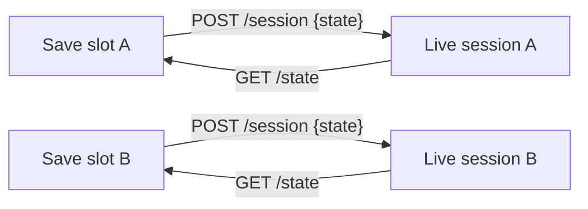

# State and save games

DARPS keeps live sessions in memory. The host owns persistence and may support
any number of save slots.



The state blob includes its `state_version`, `pack_id`, and `darps_spec` plus:

- learned fact IDs;
- character tracks;
- persona scores and recent persona inputs;
- canon;
- conversation history;
- fruitless-turn pacing state;
- turn count.

It intentionally excludes location, inventory, presence, quests, and flags.

## Save

```http
GET /state?session=abc123
```

Store the returned `state` object unchanged in the host's save slot.

## Restore into a new session

```http
POST /session
Content-Type: application/json

{"state": { ... }}
```

## Replace an existing session

```http
POST /state
Content-Type: application/json

{"session":"abc123","state":{ ... }}
```

Restore rejects the wrong pack/spec/state version, malformed fields, and
unknown IDs. Missing narrative fields receive defaults; numeric track and
persona values are clamped to current bounds.
