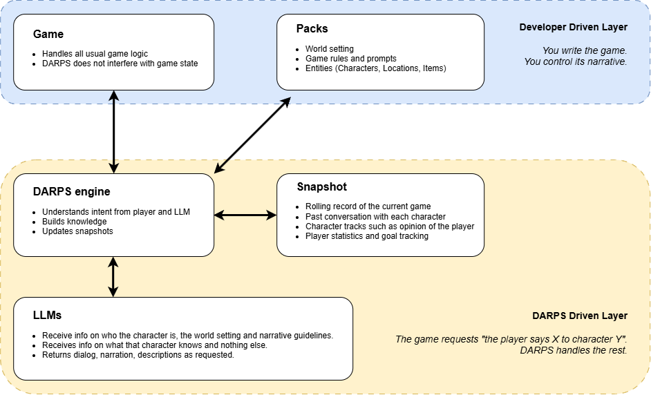

# DARPS

DARPS (Dynamic Agentic RolePlaying System) is a conversation layer between a host game and an LLM.
What if your game didn't have a list of conversation options? What if your players could just talk freely to NPCs?

DARPS helps solve this problem through an easy-to-use API. You tell it who you're talking to and what you're saying and DARPS will:

- Check if the query broke the rules of your game
- Pull information on that character
- Build a knowledge graph of other game entities the character knows about
- Retrieves LLM-driven responses to your input
- Manage characters' changing attitudes toward the player
- Understand if their response revealed anything important

!!! important "The central rule"
    You own the narrative truth; LLMs only narrate.
	Build 'packs' with great settings, intruiging characters and interesting locations. Then use DARPS to let players interact with it.
	DARPS uses strict isolation of knowledge so you can trust it to not leak secrets or go on a narrative tangent.

# How it works

Your game names the character being addressed—or the object being examined—and supplies the current world snapshot.
DARPS assembles only the context that interaction may see, calls the model, validates its proposed events, and returns prose plus narrative deltas.

## Choose your path

-   **Try DARPS**

    ---

    Run the reference scenario, then create a minimal pack.

    [Getting started](getting-started/index.md)

-   **Write game content**

    ---

    Define characters, locations, items, knowledge, and discoveries.

    [Pack authoring](authoring/index.md)

-   **Connect a game**

    ---

    Integrate sessions, calls, streaming, saves, and host events.

    [Host integration](integration/index.md)

-   **Understand the engine**

    ---

    Follow information through context assembly and validation.

    [Engine internals](internals/architecture.md)

The [pack specification](reference/pack-specification.md) is the normative
contract. Tutorials explain it; they do not replace it.
