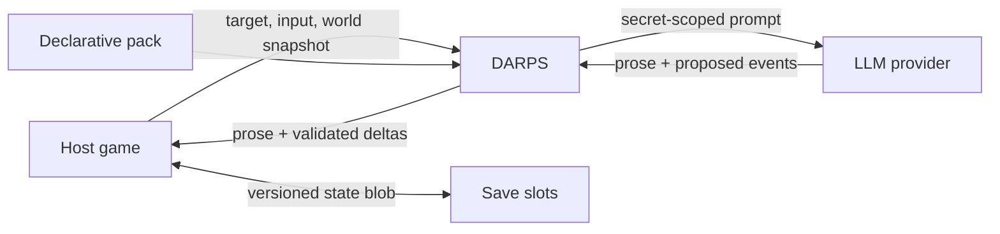

# DARPS

DARPS is a conversation layer between a host game and an LLM. Your game names
the character being addressed—or the object being examined—and supplies the
current world snapshot. DARPS assembles only the context that interaction may
see, calls the model, validates its proposed events, and returns prose plus
narrative deltas.

## What DARPS gives you

- Structurally isolated character knowledge and secrets.
- Engine-validated discoveries instead of trusting generated prose.
- Stateful character attitudes, player persona judgements, journal facts,
  canon, and conversation memory.
- Blocking and streaming dialogue and examination APIs.
- Declarative YAML packs with static solvability validation.
- A small Python sidecar and a reference C# client for game engines.

## Choose your path

-   **Try DARPS**

    ---

    Run the reference scenario, then create a minimal pack.

    [Getting started](getting-started/index.md)

-   **Write game content**

    ---

    Define characters, locations, items, knowledge, and discoveries.

    [Pack authoring](authoring/index.md)

-   **Connect a game**

    ---

    Integrate sessions, calls, streaming, saves, and host events.

    [Host integration](integration/index.md)

-   **Understand the engine**

    ---

    Follow information through context assembly and validation.

    [Engine internals](internals/architecture.md)

!!! important "The central rule"
    The engine owns narrative truth; LLMs only narrate. Generated text never
    changes state except through an explicit validation path.

The [pack specification](reference/pack-specification.md) is the normative
contract. Tutorials explain it; they do not replace it.
