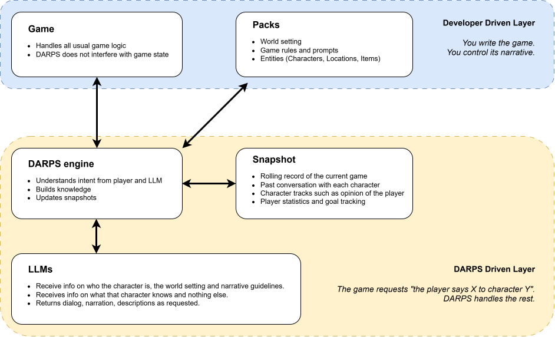

Dynamic Agentic Roleplaying System

# DARPS

What if your game didn't have a list of conversation options? What if your players could just talk freely to NPCs?
DARPS helps solve this problem through an easy-to-use API. You tell it who you're talking to and what you're saying and DARPS

[Get started](setup/index.md){ .md-button .md-button--primary }
[Why DARPS?](#why-darps){ .md-button }

DARPS features:

- Guardrails so players can't break the rules of your game
- Extensive knowledge graphing to build realistic character knowledge
- Secret-first approach means LLMs can't reveal your game's secrets by accident
- Manages changing attitudes of characters and understands player attitudes
- Fuzzy matching to understand conversations and link it to important game objects
- Caching to minimise work on common knowledge
- And much more!

## Why DARPS?

You can't just send player text to an LLM and expect something good to come back.

If a player asks "When did halloway arrive?" but your game ID for Mr Halloway is 'butler', does your game understand? If they need to "inspect the decanter" but they actually "sniff the brandy" does it just fail? Players are unpredictable but your game logic cannot be. You can't build game logic on an infinite spectrum of possible queries and responses.
LLMs will make things up, leak secrets, lack understanding of your game, use inconsistent tone. The end result isn't much better than a random conversation.

DARPS uses its 'resolver' to understand inputs so player text is linked directly to your game objects. It knows Mr Halloway is The Butler and they have id 'butler'. It knows the decanter has odd-smelling brandy and can understand when a player has made the right connection even if the language doesn't 100% line up - or maybe they just made a spelling mistake!

DARPS understands the player's tone and lets characters react to it. Does a character respond to threats? Does a joke loosen them up? It builds sophisticated knowledge graphs from your game's entities to ensure their knowledge is rich and unique to each character. That knowledge contains only permitted facts so an LLM never has information it shouldn't - and thus cannot be tricked into revealing important plot beats.

The end result is natural conversation between the player and your game with responses that are reliable, bespoke, and immersive for your world.

## Choose your path

-   **Try DARPS**

    ---

    Run the reference scenario, then create a minimal pack.

    [Getting started](setup/index.md)

-   **Write game content**

    ---

    Define characters, locations, items, knowledge, and discoveries.

    [Pack authoring](authoring/index.md)

-   **Connect a game**

    ---

    Integrate sessions, calls, streaming, saves, and host events.

    [Host integration](integration/index.md)

-   **Understand the engine**

    ---

    Follow information through context assembly and validation.

    [Engine internals](internals/architecture.md)

As the dev, you create your game as normal. But instead of providing limited dialogue options and logic, you define your world and its characters in a DARPS Pack.
