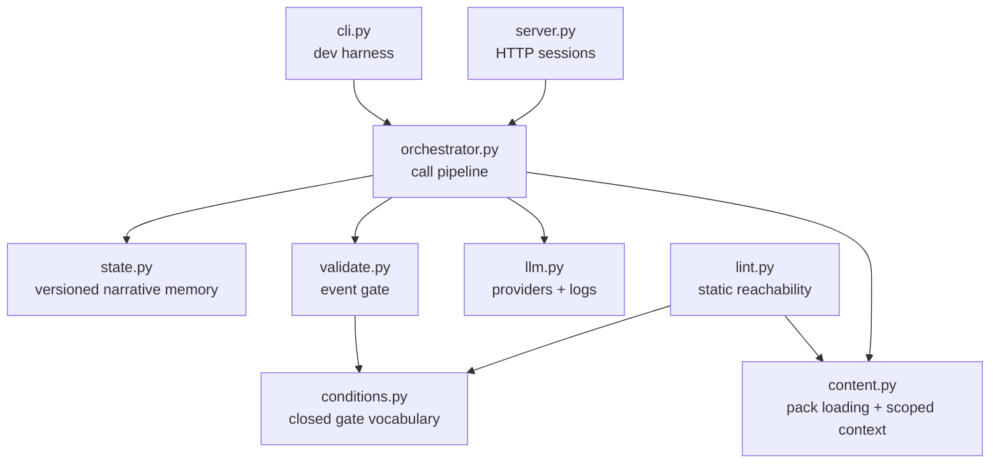
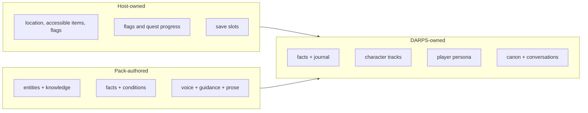

# Architecture

DARPS is intentionally small: one orchestrator coordinates content loading,
classification, response generation, validation, and state application.

## Module responsibilities

| Module | Owns | Must not own |
|---|---|---|
| `orchestrator.py` | Call pipelines, context selection, pacing, deltas | Pack-specific story logic |
| `content.py` | Pack loading, prompt layering, knowledge rendering | State mutation |
| `conditions.py` | Closed runtime condition evaluation | Arbitrary expressions |
| `validate.py` | Filtering model-proposed events | Unvalidated state writes |
| `state.py` | State shape, normalization, local harness saves | Host world state |
| `llm.py` | Provider adapters, streaming, call logs | Narrative policy |
| `lint.py` | Static schema and reachability checks | Runtime-only semantics that disagree with validation |
| `server.py` | Local transport, sessions, locks, structured errors | Persistence |

## Ownership boundary

The host sends world state but DARPS never persists it. DARPS returns deltas
but never performs host-game actions.
