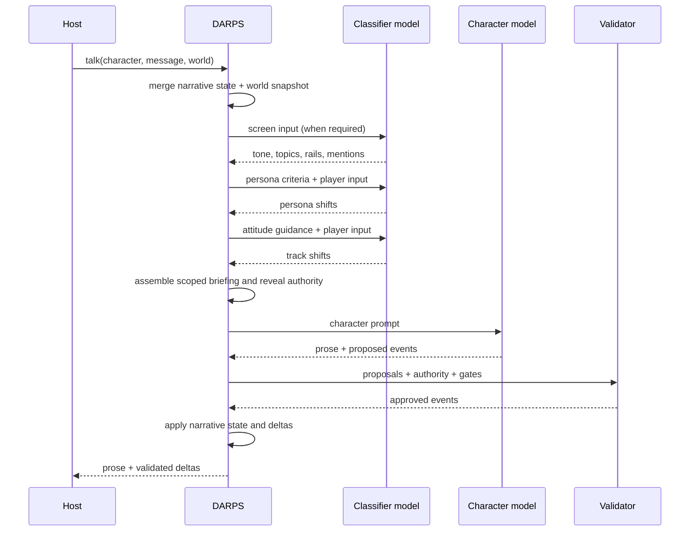
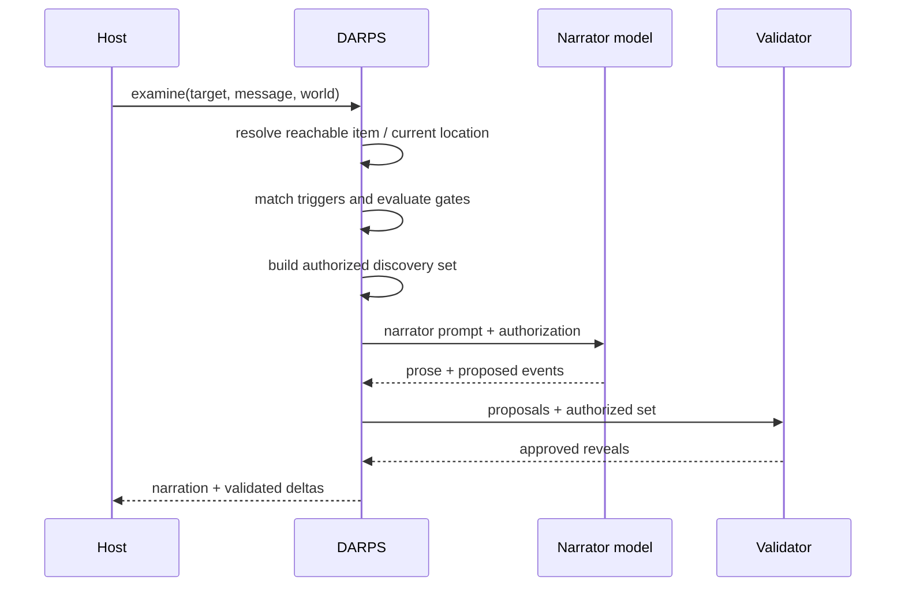
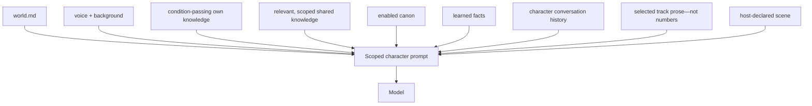
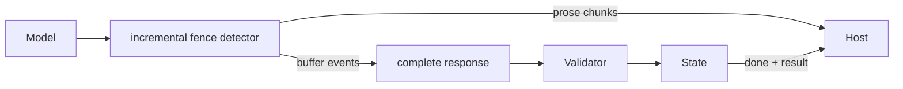

# Information and data flow

## Talk

## Examine

## Character context assembly

Ground-truth variables never enter prompts directly. They only decide whether
gated content exists in the assembled context.

## Streaming truth boundary

