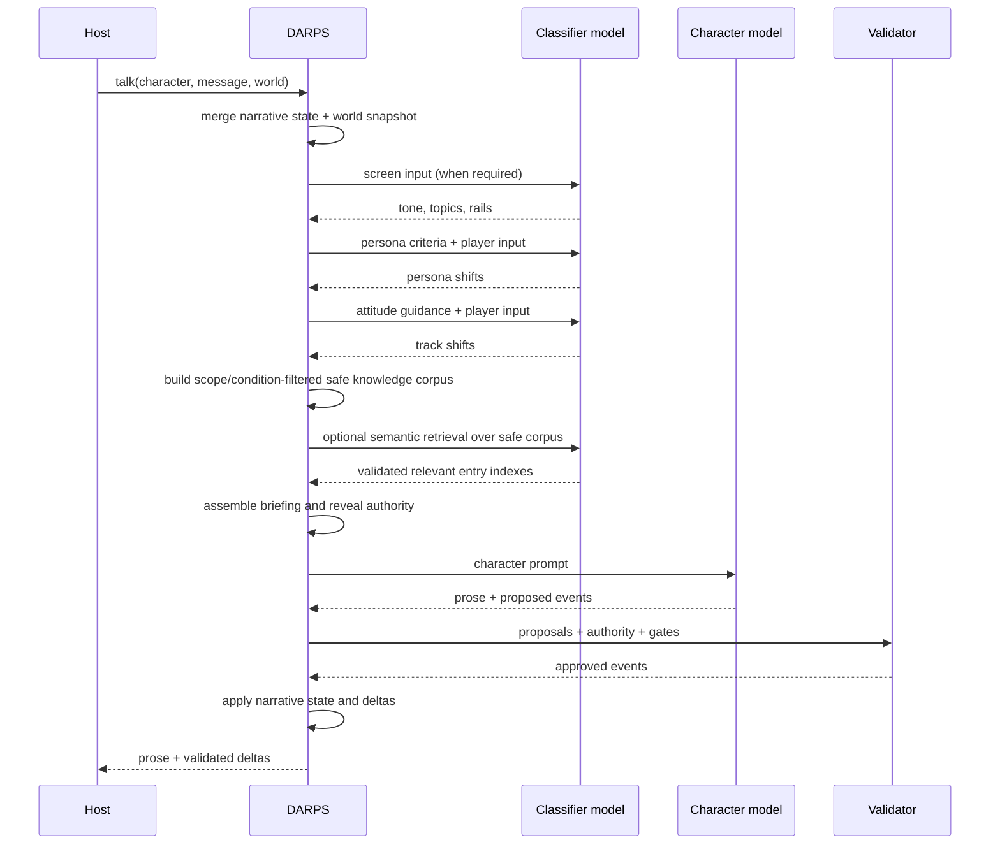
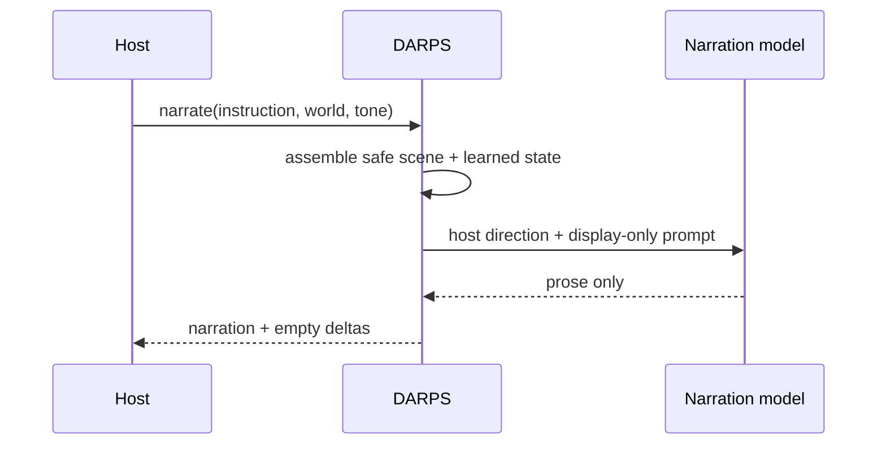
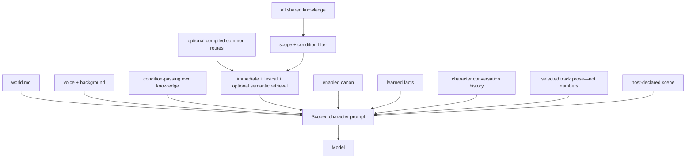
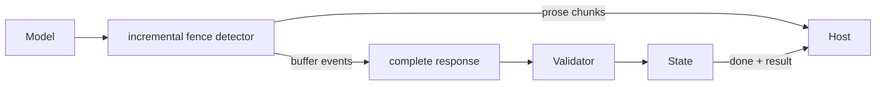

# Information and data flow

## Talk

```mermaid
sequenceDiagram
    participant H as Host
    participant D as DARPS
    participant C as Classifier model
    participant R as Character model
    participant V as Validator

    H->>D: talk(character, message, world)
    D->>D: merge narrative state + world snapshot
    D->>C: screen input (when required)
    C-->>D: tone, topics, rails
    D->>C: persona criteria + player input
    C-->>D: persona shifts
    D->>C: attitude guidance + player input
    C-->>D: track shifts
    D->>D: build scope/condition-filtered safe knowledge corpus
    D->>C: optional semantic retrieval over safe corpus
    C-->>D: validated relevant entry indexes
    D->>D: assemble briefing and reveal authority
    D->>R: character prompt
    R-->>D: prose + proposed events
    D->>V: proposals + authority + gates
    V-->>D: approved events
    D->>D: apply narrative state and deltas
    D-->>H: prose + validated deltas
```

## Examine

```mermaid
sequenceDiagram
    participant H as Host
    participant D as DARPS
    participant C as Classifier model
    participant N as Narrator model
    participant V as Validator

    H->>D: examine(target, message, world)
    D->>D: resolve reachable item / current location
    D->>D: evaluate source + fact gates; match exact triggers
    D->>C: optional semantic match over eligible trigger groups
    C-->>D: validated relevant rule indexes
    D->>D: build authorized discovery set
    D->>N: narrator prompt + authorization
    N-->>D: prose + proposed events
    D->>V: proposals + authorized set
    V-->>D: approved reveals
    D-->>H: narration + validated deltas
```

## General narration

```mermaid
sequenceDiagram
    participant H as Host
    participant D as DARPS
    participant N as Narration model

    H->>D: narrate(instruction, world, tone)
    D->>D: assemble safe scene + learned state
    D->>N: host direction + display-only prompt
    N-->>D: prose only
    D-->>H: narration + empty deltas
```

This path has no player-input classifiers or event gate because it has no
mutation surface. It does not advance turns, histories, persona, or pacing.

## Character context assembly

```mermaid
flowchart TD
    World["world.md"] --> Briefing
    Character["voice + background"] --> Briefing
    Own["condition-passing own knowledge"] --> Briefing
    AllShared["all shared knowledge"] --> Safe["scope + condition filter"]
    Cache["optional compiled common routes"] --> Relevant
    Safe --> Relevant["immediate + lexical + optional semantic retrieval"]
    Relevant --> Briefing
    Canon["enabled canon"] --> Briefing
    Journal["learned facts"] --> Briefing
    History["character conversation history"] --> Briefing
    Track["selected track prose—not numbers"] --> Briefing
    Scene["host-declared scene"] --> Briefing
    Briefing["Scoped character prompt"] --> Model
```

Ground-truth variables never enter prompts directly. They only decide whether
gated content exists in the assembled context.

The compiled route catalogue is used only inside optional semantic retrieval.
Its selections are translated back to exact entries from `Safe` before the
briefing and reveal authority are built. Cache failure removes the `Cache`
edge and leaves the original flow unchanged.

## Streaming truth boundary

```mermaid
flowchart LR
    Model --> Detector["incremental fence detector"]
    Detector -->|"prose chunks"| Host
    Detector -->|"buffer events"| Complete["complete response"]
    Complete --> Validator
    Validator --> State
    State -->|"done + result"| Host
```

General narration uses the same fence suppression and `done` framing, but
skips validation and state because its final deltas are always empty.
